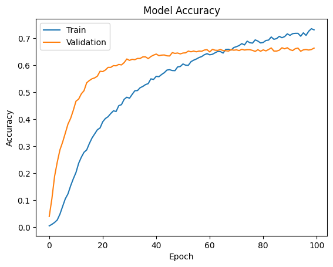
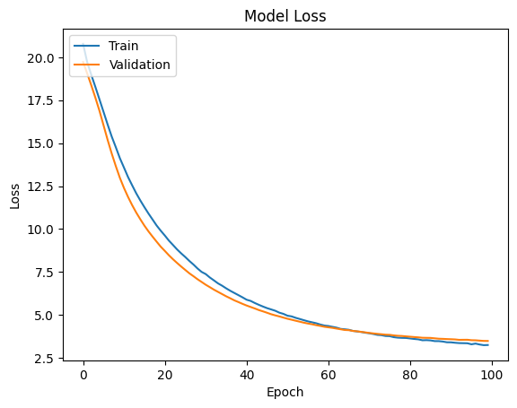
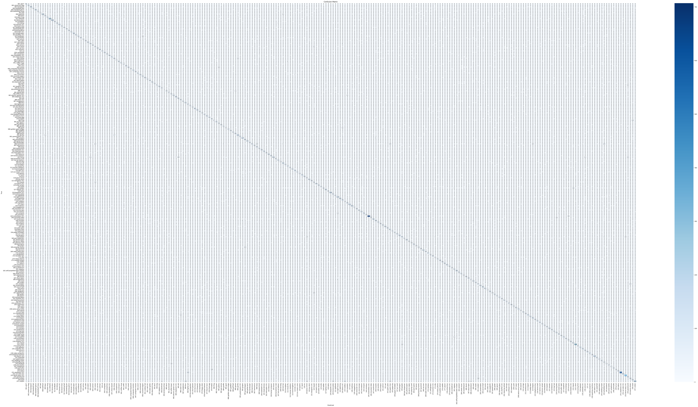

# 🖼️ Caltech-256 Image Classification with EfficientNetB0

**CS6482 – Deep Reinforcement Learning | Assignment 1**

**Contributors: Tarun Bezawada (24141771), Kedhar Eashwar (24165409)**

This project tackles multi-class image classification using the **Caltech-256** dataset (30,607 images across 257 categories). We fine-tuned a pre-trained **EfficientNetB0** model using **transfer learning**, achieving a **97.88% validation accuracy**. The entire pipeline was executed on a **NVIDIA T4 GPU** with a robust, reproducible workflow.

---

## 🚀 Key Highlights

- ✅ **97.88% Validation Accuracy** with EfficientNetB0 (ImageNet weights)
- 🔁 **Transfer Learning** with a custom classification head
- 🧪 Extensive **data augmentation** for better generalization
- 📈 Visualized **training curves** and **confusion matrix**
- ⚙️ End-to-end implementation in Jupyter Notebook using TensorFlow/Keras

---

## 🛠️ Tech Stack

| Tool / Library          | Role                                                             |
|-------------------------|------------------------------------------------------------------|
| **TensorFlow / Keras**  | Model building, training, fine-tuning                           |
| **EfficientNetB0**      | Backbone CNN (pre-trained on ImageNet)                          |
| **NumPy, Pandas**       | Data manipulation and preprocessing                             |
| **Matplotlib, Seaborn** | Visualization of model performance                              |
| **Scikit-learn**        | Metrics, classification report, confusion matrix                |
| **Kaggle API**          | Programmatic dataset download and integration                   |

---

## 🧠 Skills Demonstrated

- **Deep Learning**: Applied CNNs to real-world, high-dimensional image data  
- **Transfer Learning**: Fine-tuned pre-trained models for domain adaptation  
- **Data Engineering**: Built efficient pipelines with preprocessing and augmentation  
- **Model Optimization**: Used `ReduceLROnPlateau`, early stopping, and batch normalization  
- **Evaluation**: Assessed performance with validation metrics and visual tools  
- **Reproducibility**: Packaged in a clear, well-documented Jupyter notebook

---

## 📊 Results Summary

| Metric              | Value                     |
|---------------------|---------------------------|
| Validation Accuracy | **97.88%**                |
| Validation Loss     | 0.1332                    |
| Optimizer           | Adam                      |
| Loss Function       | Categorical Crossentropy  |
| Training Time       | ~30–40 minutes (NVIDIA T4)|

---

## 📉 Visual Insights

### 📌 Training Curves

Training and validation accuracy/loss over 20 epochs. The curves show convergence and minimal overfitting:

<p align="center">
  
  
</p>

---

### 📌 Confusion Matrix

Evaluates per-class prediction performance across 257 classes. Strong diagonal indicates consistent correct classification:

<p align="center">
  
</p>

---

## 📦 Dataset & Model Info

- **Dataset**: [Caltech-256](http://www.vision.caltech.edu/Image_Datasets/Caltech256/)  
  - 30,607 images  
  - 257 classes (including clutter)  
- **Image Input Shape**: `224 × 224 × 3`  
- **Model Architecture**: EfficientNetB0 + Global AvgPooling + Dense (softmax)

---

## 🔧 Getting Started

Follow these steps to run the project locally:

```bash
# 1. Clone the repository
git clone https://github.com/TarunBezawada11/CNN-Caltech256-Classification
cd CNN-Caltech256-Classification

# 2. Install dependencies
pip install -r requirements.txt

# 3. Launch the notebook
jupyter notebook "CS6482_Assign1_24141771_24165409 final.ipynb"
